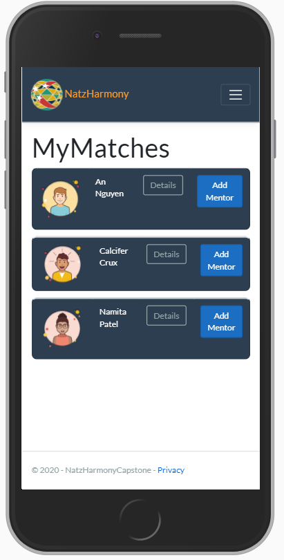
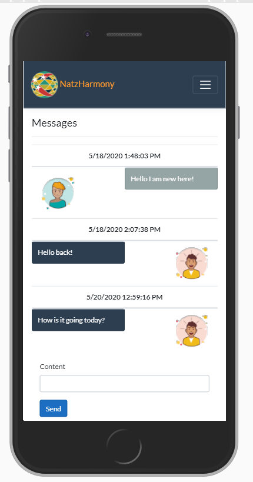
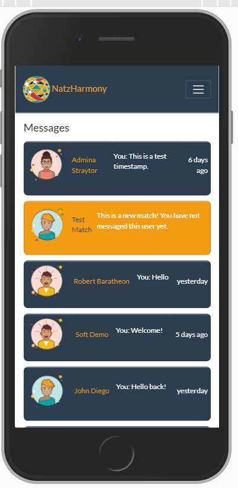

# Welcome to NatzHarmony

This is a mentorship program for a local non-profit TIRRC (Tennessee Immigrant and Refugee Rights Coalition). It allows users to create an account, build out their profile, and then match users with 3 potential mentors based on their profile information. Users may then chat with a mentor, while mentors will be able to chat with multiple mentees(users). 

NatzHarmony is an Asp.NetCore MVC web app with Entity and Identity Frameworks styled with a bootstrap theme from Bootswatch.

<table>
  <tr>
    <td>Matches View</td>
     <td>Messages View</td>
     <td>Single Conversation</td>
  </tr>
  <tr>
    <td></td>
    <td></td>
    <td></td>
  </tr>
 </table>

  
  

## Hi-Fidelity Figma Mockup:
https://www.figma.com/proto/TJp9ggRNziv6yTAAmMjX6p/Casa-Asafran?node-id=22%3A0&scaling=min-zoom

## Case Study:
https://bit.ly/Alcanza2020

## Installation

From your terminal run git clone SSH KEY HERE

Open Visual Studio

Under the tools tab, open the NuGet Package Manager console and run Update-Database to run migrations

Build and run the application after migrations are complete

## Usage
1. Register a new mentee user or sign into an existing account
2. During registration, determine matching preferences for potential mentor
3. Select and view a potential mentor based on matching criteria.
4. After matching send direct messages to mentor.
5. A mentor user can view multiple conversations of matched mentees, with relative timestamp and last message sent from the mentee or mentor. 
6. Unread messages or incoming messages are highlighted in orange to indicate that an action needs to be taken.
